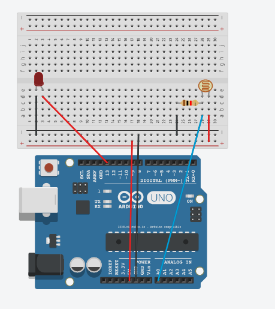
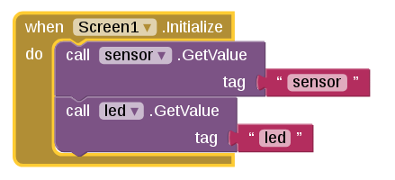
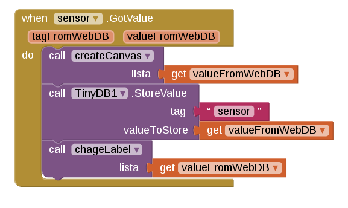
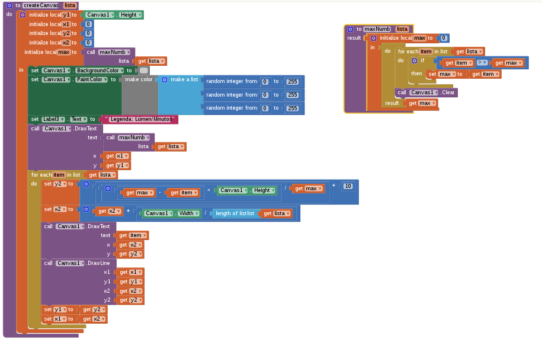
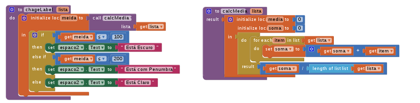
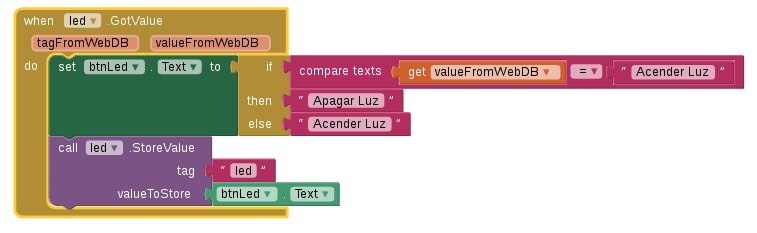
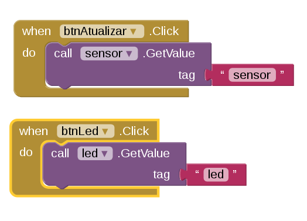

# Comunicação Web AppInventor e Arduino

Projeto realizado na [FATEC Indaiatuba](http://fatecid.com.br) que comunica um arduino com uma aplicação AppInventor usandoTinyWebDB e comunicação serial(usando Python).

## Pacotes Python

Versão do Python 3.5

[requests](http://docs.python-requests.org/en/master/), [pyserial](https://pypi.python.org/pypi/pyserial) e [beautifulsoup4](https://www.crummy.com/software/BeautifulSoup/bs4/doc/)

## Código Arduino

[appinvetor.ino](appinvetor.ino)

```
//Variáveis 
int lumins = A0;
int led = 13;
char inChar = 'd';

//Informações iniciais 
void setup() {
  Serial.begin(9600);
  pinMode(led, OUTPUT);
}

void loop() {
  Serial.available();//Esperando Informação da porta Serial
  inChar = (char)Serial.read();//Lendo informação
  if(inChar == 'd'){//Codição para acender led
    digitalWrite(led,LOW);
  }else if(inChar == 'l'){
    digitalWrite(led,HIGH);
  }
  Serial.print("s");//Enviando informações para a porta Serial
  Serial.print(analogRead(lumins));
  Serial.print("\n");
  delay(1000);
}
```

## Circuitos Arduino

[Veja o Circuito](https://circuits.io/circuits/5257117-the-unnamed-circuit/embed#breadboard)



## Código Python

[appinvetor.py](appinvetor.py)

```
#Pacotes do Projeto
import requests 
import json
import serial #Pacote externo pyserial 
import time
from bs4 import BeautifulSoup #Pacote externo BeautifulSoup

#Setando variáveis
comport = serial.Serial('<Porta Serial>',9600)
# exemplo de portas serial /dev/ttyACM0 - Linux, COM01 - Windowns

#Variáveis usadas 
sensor = []
led = ""
i = 0

#Método que modifica tags no TinyWebDB
def modif(tag,value):
    url = 'http://qrtalk-1155.appspot.com/storeavalue'
    payload = {'tag': tag, 'value': value,'fmt':'html'}
    headers = {'content-type': 'application/x-www-form-urlencoded; charset=UTF-8'}
    r = requests.post(url, params=payload, headers=headers)

#Método que recebe informações do TinyWebDB 
def getvalue():
    url = 'http://qrtalk-1155.appspot.com//getvalue'
    payload = {'tag': 'led', 'fmt':'html'}
    headers = {'content-type': 'application/x-www-form-urlencoded; charset=UTF-8'}
    r = requests.post(url, params=payload, headers=headers)
    return r.content

#Método que filtra o HTML recebido do TinyWebDB
def getHTML():
    soup = BeautifulSoup(getvalue(),"html.parser")
    isLed = False
    for text in soup.find_all("td"):
        if isLed:
            led = text.text
        if text.text == 'led':
            isLed = True
        else:
            isLed = False
    return led

#Loop infinito
while True:
    time.sleep(0.5) #Delay de meio segundo
    if i >= 10: #Condição para envio dos dados para o TinyWebDB
        print(sensor)
        modif("sensor",str(sensor))
        sensor = []
        i = 0
        led = getHTML()
    if led.replace('"', "") == "Apagar Luz":#Condição para envio dos dados a Porta Serial
        comport.write('l'.encode())
    else:
        comport.write('d'.encode())
    tag = str(comport.readline())#Leitura da Porta Serial
    print(tag)
    if tag[0] == 's':
        sensor.append(int(tag[1:]))
    i = i +1

```
## Blocks - App Inventor

Inicio da Aplicação 



Recebendo Informação do TinyWebDB - TAG sensor



Criando gráfico no Canvas 



Atualizando Label com novo valor



Recebendo Informação do TinyWebDB - TAG led



Ações dos Botões



